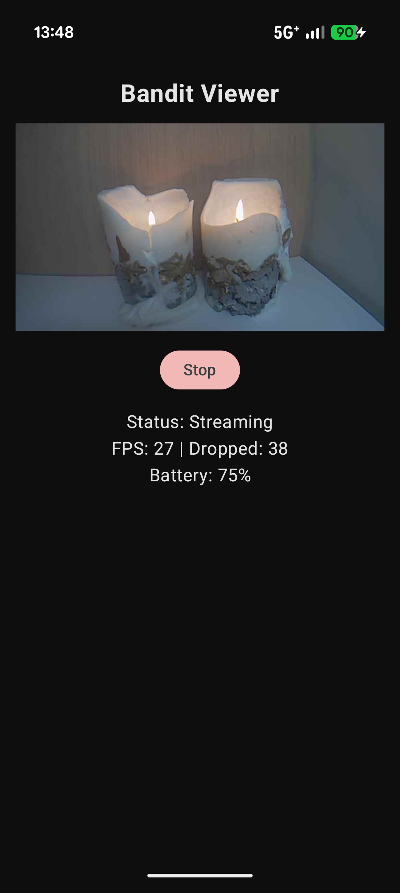

<h1>
  
  Bandit Viewer
</h1>

A minimal, open-source Android app to view the live viewfinder of a discontinued TomTom Bandit action camera.

**Note: This is an unofficial app and is not affiliated with, endorsed, or supported by TomTom.**



## Requirements
- TomTom Bandit action camera with firmware 1.57.500 or newer.
- Android device running Android 8.0 (API 26) or newer.

## Build Instructions
1. Clone the repository.
2. Open in Android Studio or build via command line:
   ```bash
   ./gradlew assembleDebug
   ```
3. Install the APK:
   ```bash
   adb install app/build/outputs/apk/debug/app-debug.apk
   ```

## How to Use
1. **Turn on the Bandit's Wi-Fi**: Push UP on the camera's four-way pad.
2. **Join the Camera's Network**: Go to your Android device's Wi-Fi settings and join the camera's network (e.g., `Bandit-XXXX`). If Android warns there is no internet, choose "Stay connected".
3. **Open Bandit Viewer**: Open the app and tap **Start**.

## Troubleshooting
- **Connection Drops**: If the connection is unstable, try turning off "Switch to mobile data" or "Adaptive Wi-Fi" in your Android settings.
- **No Frames**: If the app connects but shows no video, tap **Stop** then **Start** again.
- **Android 17 (API 37)+**: On Android 17 and newer, the app requires the **Local Network** permission to connect to the camera. If prompted, please allow it. You can also manage this in Settings > Apps > Bandit Viewer > Permissions.
- **Python Test**: If the camera works with the Python test file in /scripts but not the app, verify that the app has all requested network permissions.

## How it Works
The app communicates with the camera over its local Wi-Fi network (typically at `192.168.1.101`).
- **Control**: Plain HTTP REST API (version 2).
- **Video**: UDP stream of JPEG frames on port 4001. Frames are reassembled from custom datagrams.

For more details, see [PROTOCOL.md](docs/PROTOCOL.md).

## Credits
Protocol knowledge was derived from TomTom's Apache-2.0 licensed [BanditCameraKit-Android](https://github.com/tomtom-international/BanditCameraKit-Android) repository. No code from that repository was copied.

## License
Licensed under the MIT License. See [LICENSE](LICENSE) for details.
